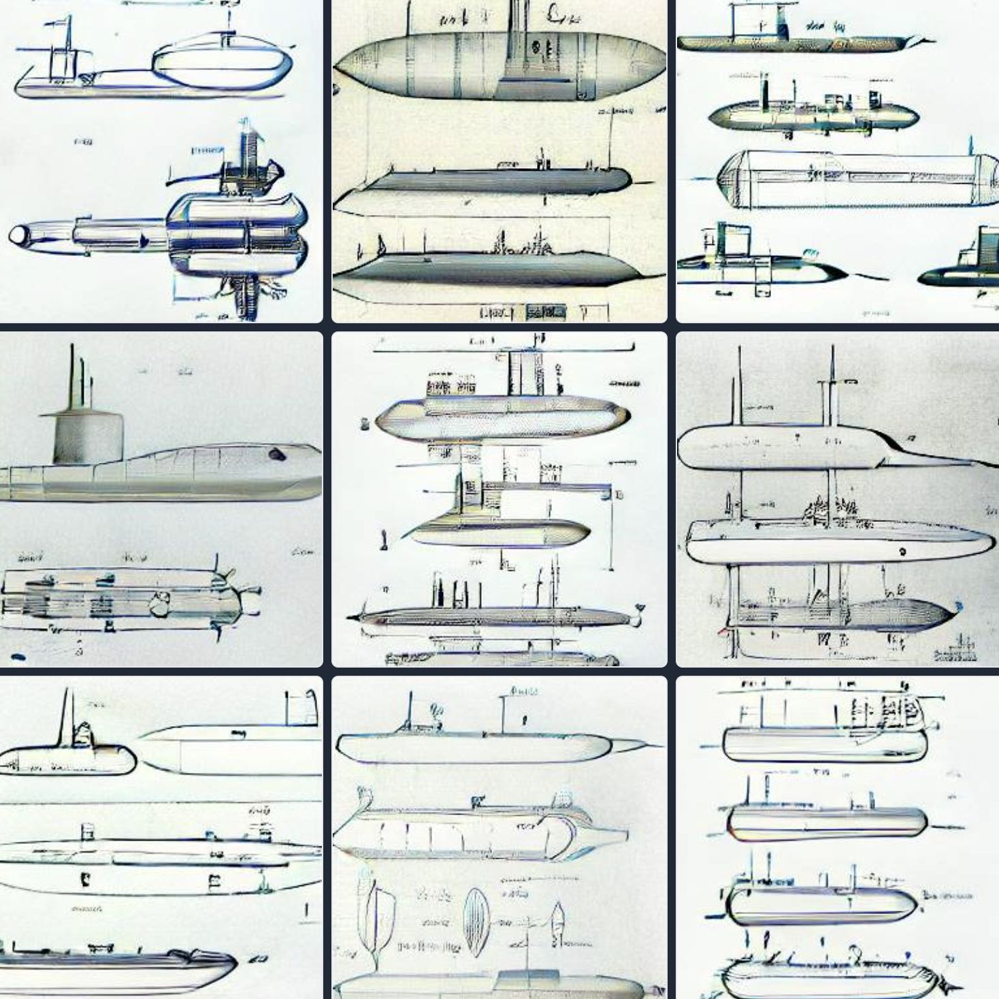

<!--
theme: gaia
class:
 - invert
headingDivider: 2 
paginate: true
-->

<!--
_class:
 - leads
 - invert
-->

# Discussion: DRUID 2022 Session - Markets for technology: Litigation
Roman Jurowetzki, Aalborg University Business School, DK

# Great, somewhat "niche" session
* I learned a lot about agency in patenting
* As an IP analytics person sometimes we are maybe a bit *naive* about patents
* Probably the 3 presenters should have a drink of your choice together and "cross-pollinate"
* Overview of exciting data sources 💾

# Continuation Patents and Litigation
Cesare Righi

<!--  -->

## Recap

* **The use of continuations leads to more litigation.** 
* Yes! - Thorough econometrics.
* Submarine patenting and claims 🐡🐠 - that's not nice 😬
* Limiting the practice may help reduction of litigation
* Yet: investment in innovation may be reduced

## Feedback
* Excellent insight into the processes of litigation
* Well written
* Takes various perspectives (one by one)

## More Feedback
* Data: Patstat Fall 2014 (is the age an issue?)
* Textual distance. How well does Keyword-Jaccard really capture scope in claims?
* Structure a bit confusing - several waves of analysis create an impression of more than 1 paper in a paper
* More focus on potential consequences for investment in innovation

# NPEs, Patent Quality and Litigation Strategies across European Jurisdictions
Valerio Sterzi, Cecilia Maronero, Andrea Vezzulli

## Recap
* Early draft and an array of ideas for future development
* "...aims to investigate the relationship between the quality of the litigated patents and the specific legal regimes of the countries in which NPEs choose to assert those intellectual property rights."
* you do exactly that 😅
* Fee-based regimes (🇬🇧/🇫🇷) vs injunctive regimes (🇩🇪/🇮🇹)
* NPEs less likely to assert in 🇬🇧/🇫🇷
* However more likely to assert in 🇬🇧/🇫🇷 for higher quality patents (forward citations) vs incremental (backward citations)

## Some reflections

* How many and how much? (more input in the presentation)
* Useful functions? Should PEs learn from NPEs?
* Great data and approach.
* Patent quality indicators.
* Econometrics may need some work (already mentioned...)
* Interesting research outlook. Especially specificity of courts.
* Policy implications?

# CEO Overconfidence and the Decision to take a Patent Litigation Case to Trial
Zhe Yang, Nikolaos Papagergiadis, Andreas Procopiou, Wolfgang Sofka

## Recap

* Overconfident CEO may be more likely to let litigations reach trial stage
* 2 moderating effects
* H2: Larger ratio of pending patents will increase likelihood of reaching trial stage
* H3: Weaker effect for companies with fewer financial constraints
* Cox PH regression design with binary DV: "Trial decision"
* All Hs confirmed! 🚀

## Some reflection
* "Trial decision" variable name a bit ambiguous 
* Descriptives?
* Potential differences in other legal regimes (see paper 2)
* Interaction with the legal / tech. team; How much is it really about the CEO?
* Governance of IP and CEO involvement?
* How much is it "gambling” and political? What does it tell us about the overall system?
* Probably follow-up needed. e.g., qualitative interviews

